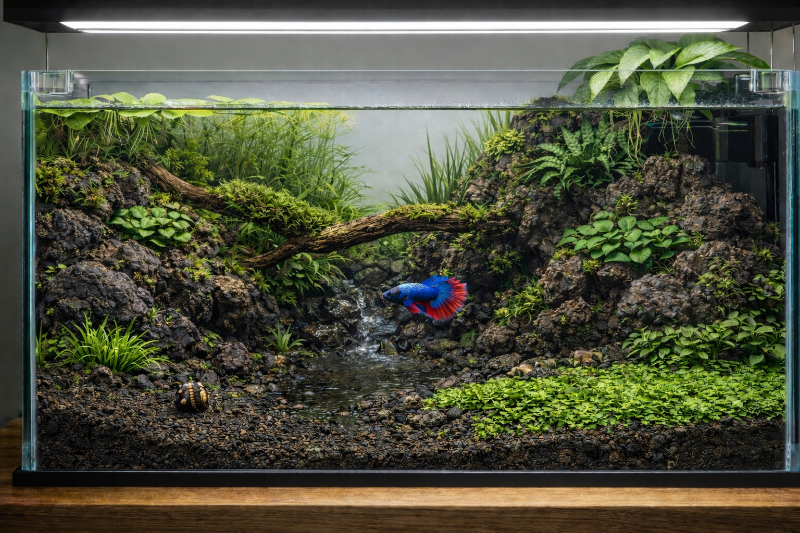

# Barranco

Barranco es un ecosistema volcánico Low-Tech de 54L diseñado para un despacho en Tenerife, que prioriza la resiliencia y el bajo mantenimiento mediante una densa masa vegetal y una subcarga biológica liderada por un Betta splendens. Basado en la estética Wabi-Sabi y la estabilidad natural, el sistema utiliza roca porosa y flora emergida como filtros biológicos activos para garantizar un entorno autónomo, equilibrado y de mínima intervención.

## Premisas

- Despacho muy tecnológico de ≈8 m² con AC y alta automatización en S/C Tenerife (roble, verde, negro y blanco)
- Acuario de pequeño volumen ≈40-60 L Low-Tech de inspiración Walstad (no purista)
- Mueble independiente de 32×90 cm que soporta +200 kg
  - Adyacente a mesa de trabajo elevable (frontal) y a pared (trasera)
  - Altura libre ≈70 cm hasta estante
  - Usuario sentado en la diagonal frontal izquierda
  - Ventana con luz difusa (patio interior) cerca del frontal derecho
- Usuario sin experiencia que viaja frecuentemente (2-3 días/mes) y tiene gatos
- Todo elemento debe tener una función ecológica, estructural o conductual, priorizando:
  1. **Bienestar de la fauna y flora:** alta compatibilidad y cadena trófica completa
  2. **Estabilidad y resiliencia:** mínima intervención y mantenimiento, inercia y subcarga
  3. **Estética:** subordinada a función; entorno volcánico canario (Wabi-Sabi)

```text
      VENTANA
╔════╬═══════╬═════════════════╗
║───┬───────────────┐    │  A  ║
║   │               │    │  R  ║
║███│    MESA DE    │    │  M  ║
║███│    TRABAJO    │    │  A  ║
║███│               │    │  R  ║
║───┴───────────────┘    │  I  ║
║         SILLA          │  O  ║
║                        │  S  ║
╚╬══════╬══════════════════════╝
  PUERTA

███ ACUARIO
```

## Infraestructura

- 2 masas de roca forman un cauce que desemboca en una playa abierta
  - Paisaje asimétrico, erosionado, sin ejes claros y jerárquico, con equilibrio áureo
  - Frontal despejado, exploración lateral y refugio distribuido, sin puntos de dominancia
  - *Roca volcánica:* estructura y base, porosidad muy alta, abrasiva, ligera, inerte
  - *Madera de vid:* biofilm y microfauna, dura, químicamente segura, taninos

- **Urna:** ≈60×30×30 cm (54 L, ≈45 L netos), vidrio ≥5 mm, foam ≥5 mm, vinilado esmerilado mate (trasera y derecha), tamaño usable en sistemas futuros
  - **Tapa:** de vidrio o policarbonato, apertura perimetral ≈4–5 mm y derecha más ancha para zona técnica (filtro, cables, ventilador, flora emergida) cerrada con rejilla, zona removible en frontal/izquierdo para alimentación; seguridad felina, reduce evaporación, estabiliza temperatura y EC
- **Sustrato:**
  - **Drenante** (bajo masas): roca volcánica en malla; biofiltro pasivo, expansión radicular profunda, soporte microflora y reducción de masa
  - **Nutritivo:** (excepto playa) mezcla mineral–orgánica baja reactividad; ≈1-2 cm, reserva nutricional estable y lenta, interfaz bioquímica amortiguada
  - **Arena inerte:** (homogéneo) volcánica (≈1–3 mm); ≈2–3 cm, confina sustrato nutritivo, facilita enraizamiento profundo y actividad de la fauna (micro/macro)
- **Zonas:**
  - **Masa dominante:** (trasera/media derecha) referencia de escala; disipación y regulación hidráulica, biofiltro pasivo distribuido, soporte epífitas/musgo/biofilm, refugios, descanso y observación
  - **Masa secundaria:** (trasera izquierda/media) contrapeso estructural menor altura; reconducción hidráulica, biofiltro pasivo, soporte epífitas/musgo/biofilm, refugios, descanso y observación
  - **Valle:** (frontal/derecho hasta cauce) plano abierto vegetal; cobertura vegetal, forrajeo seguro, visibilidad y rutas de escape inmediato
  - **Cauce:** (trasera/media hasta playa) eje longitudinal; distribución hidráulica, espacio de tránsito, exploración y forrajeo 
  - **Playa:** (frontal izquierdo) plano abierto; espacio negativo deliberado, zona limpia de tránsito, reposo y forrajeo
  - **Tronco:** (trasera/media a media/derecha) arco ramificado cercano a superficie; soporte epífitas/musgo/biofilm, refugio blando, descanso y observación
  - **Refugios:** (integrados en hardscape) múltiples planos verticales y oblícuos, no cerrados, no dominables y sin puntos de bloqueo territorial

## Flora

- Plantado funcional de bajo mantenimiento, sin fertilizantes ni CO₂
  - Amortiguador biológico y químico y productor oxígeno
  - 20–30 % del primer plano abierto o con tapizante funcional 

- **Fondo:** tallo alto, absorción rápida nutrientes, estabilización temprana y cierre visual posterior
  - **Limnophila sessiliflora:** (trasera/izquierda) crecimiento rápido, alto consumo NO₃/PO₄, filtro transitorio y amortiguación desequilibrios
  - **Vallisneria spiralis:** (trasera/derecha) crecimiento lento y estable, filtro radicular sostenido, alta tolerancia y mantenimiento mínimo, estructura vertical persistente
- **Medio:** masa vegetal estable y lenta, refugio, consumo radicular continuo y transición visual 
  - **Cryptocoryne wendtii 'green':** (transición hardscape/valle y bordes plano abierto) refugio y sombra, amortiguación visual roca/zona abierta, alta estabilidad
  - **Microsorum pteropus 'trident':** (roca/madera, zonas medias, flujo bajo) crecimiento lento, cierre visual blando, refugio secundario sin competir por sustrato
  - **Anubias barteri 'nana':** (roca/madera en sombra, lateral refugio, zonas descanso) zona descanso/observación, soporte de biofilm y microfauna, alta longevidad
- **Suelo:** plantado bajo, estabilización sustrato y transición funcional 
  - **Marsilea hirsuta:** (valle): tapizante lenta y resistente, cobertura permeable que estabiliza el sustrato, soporte de microfauna y tránsito suave 
  - **Sagittaria subulata:** (borde cauce y transición playa): roseta puntual, marcador de borde/transición cauce–valle–playa
- **Musgo:** soporte de biofilm y microfauna distribuida
  - **Taxiphyllum barbieri:** (parches pequeños en tronco y cavidades protegidas, flujo bajo) colonización rápida y adaptable, microhábitat invertebrados, retención partículas finas y refuerzo biológico localizado
- **Superficie:** regulación lumínica, consumo nutrientes y refugio vertical
  - **Limnobium laevigatum:** (superficie, mitad izquierda) crecimiento rápido, alto consumo de NO₃/PO₄, modulación de luz y raíces colgantes como refugio/forrajeo, control simple por retirada
- **Emergida:** refuerzo biológico aéreo, sumidero rápido de nutrientes y amortiguador de errores
  - **Epipremnum aureum:** (trasera/derecha) raíces largas y finas en agua, absorción muy eficiente de NO₃/NH₄⁺, deflector hidráulico, soporte biofilm y microfauna, alta tolerancia a poda, variaciones de luz y ausencias, crecimiento guiable, refuerza resiliencia durante viajes
- **Microflora:** (hardscape, sustrato y raíces) responsable del cierre del ciclo del nitrógeno, mineralización orgánica y amortiguación química

## Fauna

- Subcarga biológica por diseño, centrada en el betta

- **Consumidor secundario:** control conductual, carga orgánica y eje etológico del sistema
  - **Betta splendens PK/HMPK** (1M): control etológico columna de agua (media y superficie),  carga orgánica moderada, circulación suave, refugios distribuidos, sin dominancias rígidas, zonas de descanso cercanas a superficie, refugio blando y visibilidad controlada
- **Consumidores primarios:** reciclaje orgánico, control de biofilm y soporte trófico
  - **Caracol Clithon sp.** (1/2): raspador especializado de biofilm y algas duras, muy baja carga orgánica, no reproduce en agua dulce, regulador pasivo
  - **Gamba Caridina multidentata** (2M/3H): consumidor oportunista de detrito blando, biofilm y restos vegetales, refuerza reciclaje orgánico, no reproduce en agua dulce, se asume posible depredación del betta, mitiganda con refugios abundantes, tamaño e introducción y colonización previa
- **Microfauna espontánea:** base trófica distribuida y estabilización biológica
  - **Copépodos, ostrácodos y otros microcrustáceos:** se desarrollan por maduración del sistema, fuente ocasional de alimento vivo y estímulo conductual, indicadores de estabilidad y baja toxicidad
  - **Planarias y otros organismos oportunistas:** tolerables en baja densidad, control indirecto mediante equilibrio biológico y no por erradicación activa. Su presencia ocasional no indica fallo del sistema
- **Exclusiones deliberadas:**
  - Peces de cardumen o territoriales secundarios: evitar competencia y estrés
  - Caracoles de alta reproducción (Physa, Planorbarius, Melanoides): evitar plaga y carga
  - Gambas enanas delicadas o de alto valor ornamental: evitar alta carga, predación y estrés
  - Fauna bentónica excavadora: altera la estratificación del sustrato

## Química en sistema maduro

- Ventana química estable, no precisa, regulación pasiva distribuida, sin aditivos rutinarios
- Ante desviaciones reducir carga, cambios parciales y ajustes luz/flujo, no correcciones químicas agresivas

- **Parámetros:**
  - **Agua:** base RO remineralizada, reposición RO; receta fija = estabilidad iónica
  - **Cloro/cloraminas:** 0 mg/L; RO y/o acondicionador, tóxico para microflora e invertebrados
  - **Temperatura:** 25–26 ºC (24–28 ºC); AC y calentador, tapa = aire cálido/húmedo (órgano laberíntico)
  - **pH:** 6,8–7,2; KH + taninos + biología, confort fauna y margen de seguridad
  - **GH:** 6–10 dGH; remineralización, osmorregulación fauna + soporte caracol
  - **KH:** 3–5 dKH; remineralización + hardscape, amortigua pH
  - **EC:** 180–300 µS/cm; RO + remineralización, “estabilidad real” > GH/KH por separado
  - **NH₃/NH₄⁺:** 0 mg/L; subcarga + plantas rápidas + microflora, si aparece = sobrecarga o inmadurez
  - **NO₂⁻:** 0 mg/L; microflora nitrificante + oxigenación, evita toxicidad aguda
  - **NO₃⁻:** 5–15 mg/L; consumo vegetal + cambios, nutriente para plantas (evitar 0)
  - **PO₄³⁻:** 0,05–0,3 mg/L; entra por comida, sale por plantas/cambios, evita carencias y algas oportunistas
  - **DOC/taninos/húmicos:** moderados; madera/hoja seca + biofilm + detrito fino, amortiguación química y luminosa + efecto etológico
  - **Micronutrientes:** aportados por sustrato nutritivo; no suplementación rutinaria salvo carencias visibles

## Energía

- Regulación energética global del ecosistema, equilibrio luz–nutrientes–biomasa sin CO₂ externo ni fertilización líquida rutinaria
- Si aparece desbalance energético, se ajusta primero luz, luego biomasa, y solo al final hardware

- **Iluminación:** LED espectro completo, intensidad moderada, distribución homogénea y pantalla suspendida para disipación térmica y sombras naturales
- **Fotoperiodo:** 7 h objetivo (6,5–8 h según fase), rampa 30–45 min y ajustes según respuesta vegetal/algas.
- **Intercambio gaseoso:** movimiento superficial suave, oxigenación por fotosíntesis y equilibrio natural de CO₂ (sin inyección)
- **Flujo hidráulico:** lento, difuso y no direccional, dispersado por hardscape y raíces, sin corrientes directas ni zonas muertas
- **Carga energética:** biomasa vegetal activa suficientes para consumir luz disponible

## Hardware

- Acompaña a diseño para aumentar robustez y tolerancia al error, no son pilares

- **Filtro:** (derecha/atrás) de mochila, caudal medio bajo y difuso, carga mecánica y biológica, caudal regulable (dispersado por masa principal y raices emergidas), prefiltro de esponja, *p. ej. Fluval AC20*
- **Calefactor:** (lateral entrada filtro) con termostato 50W, *p. ej. Higger Mini*
- **Iluminación:** (60 cm) LED de espectro completo para low-tech, cable suspensión, shades, dimmer, y ciclos día/noche con rampa, *p. ej. Chihiros B60*
- **Puntuales:** ventilador (reducción temperatura), oxigenador (signos de hipoxia), alimentador automático (ausencias)
- **Opcionales:** ATO (si alta evaporación) 

## Montaje

1. Montaje de hardscape y flora
2. Maduración >1 mes
3. Introducción del caracol y estabilización
4. Introducción de gambas y estabilización
5. Introducción del betta

## Mantenimiento esperado en sistema estable

- Alimentación externa solo del betta: evitar sobrealimentación, 1 día de ayuno
- Fauna auxiliar y microfauna se sostienen por el propio sistema
- Cambios de agua mínimos y espaciados: ≈15% quincenales o por necesidad, mensuales si sistema muy maduro
- Limpieza/sifonado mínimo y selectivo, sin remover sustrato (permitir ciclo natural)
- Poda controlada y gradual, sobre todo *Limnophila*, que irá reduciéndose con la maduración

## Principio de Sustitución Funcional

- Barranco está diseñado por funciones y nichos, no por especies concretas
- Las elecciones actuales son la implementación válida preferible, no la única
- Lo importante no es que se parezca, es que funcione igual

- **Se permiten** cambios si se mantiene nicho ecológico, función biológica, equilibrio luz–biomasa–nutrientes, subcarga biológica, flujo lento–difuso y ventana química estable, como por ejemplo:
  - **Caracol raspador:** *Clithon sp.* por *Neritina sp.*
  - **Gamba detritívora grande:** *Caridina multidentata* por *Caridina gracilirostris* (más delicadas)
  - **Roca inerte/porosa:** *roca volcánica* por *roca Dragón* (evitar rocas calcáreas activas)
  - **Madera segura:** *madera de vid* por *Spider wood* o *Red moor* 
  - **Fondo rápido:** *Limnophila* por *Hygrophila*
  - **Fondo estructural:** *Vallisneria* por *Sagittaria* o *Echinodorus* compacto (<30 cm adulto)
  - **Zona media lenta:** *Cryptocoryne*, *Microsorum* y *Anubias* por *Bucephalandra*, *Bolbitis* u otras epífitas de bajo requerimiento
  - **Tapizante funcional:** *Marsilea* y *Sagittaria subulata* por *Helanthium* o *Cryptocoryne parva*
  - **Flotante reguladora:** *Limnobium* por *Salvinia* u otras flotantes fácilmente controlables
  - **Emergida sumidero:** *Epipremnum* por *Spathiphyllum*, *Philodendron* o *Syngonium*
- **No se permite** reducir biomasa funcional, eliminar absorción rápida en maduración, aumentar carga biológica, alterar química o romper el flujo difuso.

---


*Imagen generada por IA de Barranco*
